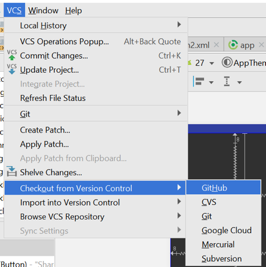
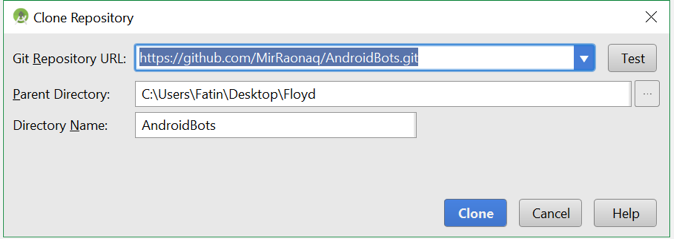
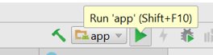

# Team AndroidBots
## Food Basket

Download Food Basket here: https://drive.google.com/open?id=1l01u2518aAtDJa1fnhxvXlq2i01CDjJt

Note: Food Basket currently runs in Android API 21, 22, and 24. When selecting a virutal device select an API between 21,22, or 24.  

### Project Description

Food Basket is for free food and items.

Suppose you are at an event and at the end there are pizza slices left. Instead of it going to waste, you can share the food with the community or people near you. Food Basket allows you to snap a picture of the food, then give a description, and location such as building, room number, and quantity. Users nearby will receive a notification of the food and will have the chance to claim it.

- No "half eaten food" meaning no food that someone has taken a bite out; same goes for drinks.

This same process also works with unwanted items such as furniture, books, and more.

**User Story**

"I want free food"

"I have food that nobody wants and I don't want to throw it away."

"I have a chair that I don't need it but it could be useful for someone else."

"There's always leftovers after the event, someone must want it."

**MVP(Minimum Viable Product)**

Food Basket is an android app that helps users share and find any leftover food or items. A user would be able to snap a picture of the food or item and share the location, along with a description such as building and room number. Other nearby users would be notified of the location and can view the picture the food. Then they will have the ability to vote whether the food is claimed or report as fake.

**Add-on Features:**

1. Ability to moderate fraud/fake activities.

2. Users would be able to register an account with the app.

3. Android smart watch compatibility.

4. Ability to use within a group instead or location. For example to only share location of food or item within a dorm hall or with a group of friends.

5. A sell section, able to quickly sell food or items for cash.

6. Food Basket for iOS.

7. Ability to use within a group instead of location. For example to only share location of food or item within a dorm hall.

**Prototype**:
https://www.youtube.com/watch?v=X_XTFI-sr04

**Alpha Release**:
https://www.youtube.com/watch?v=XYYHNZdhbGs&t=2s

**How to Run Prototype & Alpha Release**

1.	First download Android Studio from here: https://developer.android.com/studio/index.html

2.	Copy the repository link and paste into Android Studio version control then clone:

3. Once gradle has finished building the project click the green play “Run” button. Then pick any virtual device as shown below:

NOTE: The app might crash on API 25 or 23 or greater. When selecting a virtual device choose any API between 21, 22, or 24.

If you run into any gradle issues while building the project, click File>Sync Project with Gradle Files.

Also, if you have an android device and would like to run the app, connect your phone to your computer. Then enable “USB debugging” from developer option in your phone. Click run and select your device on android studio. You can also download the apk file from the link provided. Before installing the apk, go to Settings>Security and enable "unknown sources"

